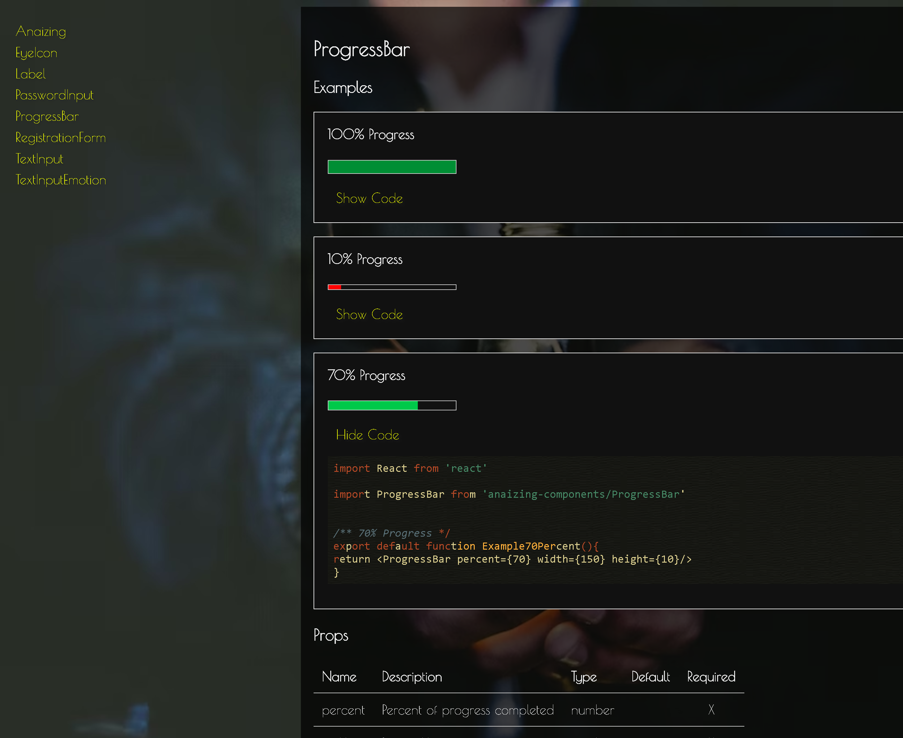
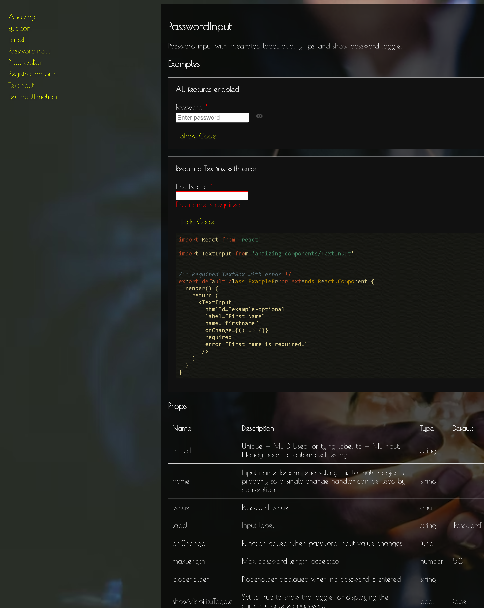

### REACT COMPONENT LIBRARY

A library of React components that incorporates atomic design principles in composition. Built from scratch, complete with docs, testing, automated code highlighting generation on props for each component, with development environment and deployment environment builds.

Developed using...

- javascript
- html
- css
- react
- babel
- webpack
- eslint
- github

[VIEW COMPONENT LIBRARY](https://anaizing.github.io/anaizing-components/)
 
[SEE THE CODE](https://github.com/Anaizing/anaizing-components)

 

> scrollable desktop view of progress component
> 

> scrollable desktop view of password component
> 
