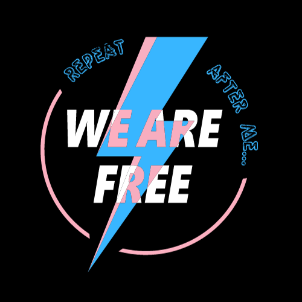

# repeat after me we are free - logo design

Step into the vibrant world of <b>repeat after me we are free</b>, where every design embodies the spirit of inclusivity and empowerment. The logo design serves as a beacon of unity, featuring a lightning bolt—a symbol of strength and power—interwoven with the colors of the transgender flag.

The choice of a lightning bolt isn't arbitrary; it embodies commitment to sparking growth and championing equality. It pays homage to those who paved the way for progress in our community. Its bold, electrifying presence signifies the mission to illuminate the world with designs that celebrate individuality, pride, and the fight for inclusivity.

Built using <i>Adobe Illustrator</i>, the logo encapsulates <b>repeat after me we are free</b>'s commitment to a more inclusive future for all generations within our community.
